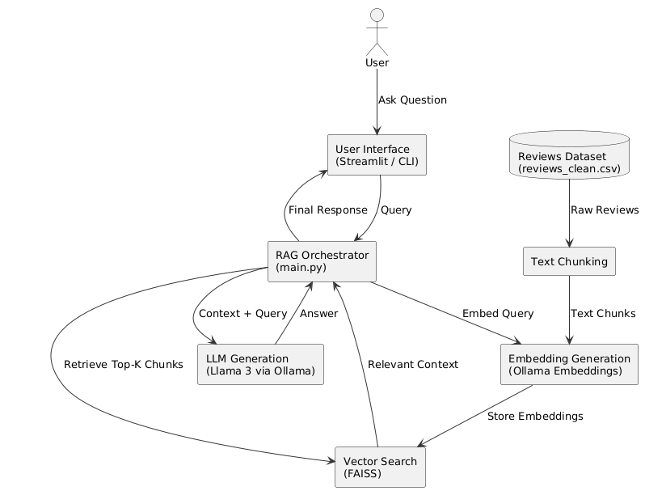

# 🧠 Review Insights AI

**Review Insights AI** is an intelligent system designed to help users understand large volumes of product reviews by answering natural language questions such as *“Is this product worth buying?”* or *“What are the common complaints?”*.

Instead of manually reading thousands of mixed reviews, the system retrieves the most relevant review snippets and generates concise, grounded insights using a Retrieval-Augmented Generation (RAG) approach.

## 🧩 Problem Statement

When buying a product online, users often rely on customer reviews to decide whether a product is worth purchasing.  
However, popular products can accumulate **thousands of reviews**, ranging from highly positive to extremely negative.

This creates several challenges:

- **Too many reviews** to read manually  
- **Conflicting opinions** that increase decision confusion  
- **Important details buried** inside long review text  
- **Star ratings lack context** and actionable explanations  

As a result, users struggle to confidently answer simple but critical questions such as:

- 🤔 *Is this product worth buying?*  
- ❌ *What are the most common complaints?*  
- 🔋 *How is the battery life, sound quality, or build quality?*  
## 🎯 Motivation

To address this problem, **Review Insights AI** was built as a system that allows users to ask **natural language questions** directly over large volumes of product reviews and receive **grounded, context-aware answers**.

Instead of skimming hundreds of individual reviews, users can simply ask questions such as:

-  *Is this speaker worth buying?*  
-  *What do people complain about the most?*  

The system intelligently retrieves the **most relevant review snippets** and generates a **concise, meaningful response**, helping users make informed purchasing decisions quickly and confidently. 

## ⚙️ What This System Does

- 📊 **Processes large-scale product review datasets** (100,000+ real-world customer reviews)  
- 🔍 **Converts reviews into searchable semantic representations** using vector embeddings  
- 🧠 **Retrieves the most relevant review content** for a given user query  
- ✍️ **Generates context-grounded answers** using a local Large Language Model (LLM)  
- 🚀 **Helps users make faster and more confident purchase decisions**

This approach shifts the user experience from **manual review skimming** to **intelligent, question-driven review analysis**, even at scale.

## 📂 Dataset & Preprocessing

### Dataset Source

This project uses the **Amazon US Customer Reviews Dataset (Electronics category) , sourced from Kaggle.  
The dataset contains **millions of real-world customer reviews**, including review text, star ratings and product metadata.

🔗 **Dataset Link (Kaggle):**  
https://www.kaggle.com/datasets/cynthiarempel/amazon-us-customer-reviews-dataset
---

### Preprocessing Overview

To make the dataset suitable for semantic search and retrieval-augmented generation, a dedicated preprocessing pipeline was implemented using a Jupyter Notebook.

The preprocessing steps include:

- 🧹 **Column selection** to retain only semantically meaningful fields  
- ✂️ **Removal of noisy and irrelevant metadata**  
- 🧠 **Merging review headline and body** into a single semantic field  
- 📉 **Handling missing values and malformed rows**  
- 🎯 **Sampling and filtering** to create a high-quality subset of **100,000+ reviews**  
- 💾 **Exporting a clean CSV** used directly by the RAG pipeline  

The final processed dataset balances **semantic richness, scale, and performance**, making it suitable for large-scale embedding and vector indexing.

## 🏗️ System Architecture

The system follows a clean and modular **Retrieval-Augmented Generation (RAG)** pipeline, where external product review data is retrieved at query time and used as grounded context for answer generation.

This design ensures that responses are **fact-based, explainable, and derived from real user reviews**, rather than relying solely on the language model’s internal knowledge.

---

### Architecture Overview



The overall workflow of **Review Insights AI** consists of the following stages:

1. **Review Dataset**  
   Cleaned and preprocessed product reviews serve as the primary knowledge source for the system.

2. **Text Chunking**  
   Reviews are split into **token-aware text chunks** to preserve semantic coherence while enabling efficient retrieval.

3. **Embedding Generation**  
   Each text chunk is converted into a dense vector representation using a **local embedding model**, enabling semantic similarity search.

4. **Vector Search (FAISS)**  
   A FAISS-based vector index stores all embeddings and supports **fast nearest-neighbor search** at scale.

5. **Query-Time Retrieval**  
   User queries are embedded at runtime and matched against the most relevant review chunks in the vector index.

6. **Answer Generation**  
   **Llama 3** generates a concise, context-aware response grounded strictly in the retrieved review content.
   
## 🧰 Technology Stack & Design Choices

This project was intentionally designed with a **lightweight, modular stack** to emphasize clarity, control, and understanding of core RAG components, rather than relying on heavy abstractions.

Below is an overview of the key technologies used and the reasoning behind each choice.

---

### 🐍 Programming Language & Environment
- **Python**
- **Jupyter Notebook** (for data preprocessing and exploration)
- **VS Code** (for development)

Python was chosen for its strong ecosystem in data processing, machine learning, and rapid prototyping.

---

### 📂 Dataset
- **Amazon US Customer Reviews Dataset (Electronics)**  
- Source: Kaggle

A large-scale, real-world dataset was selected to ensure the system operates on **non-trivial data volumes** and reflects realistic review diversity and noise.

---

### ✂️ Text Chunking
- **Custom token-aware chunking**

Instead of naive fixed-length splitting, reviews are chunked in a token-aware manner to preserve semantic coherence while remaining suitable for embedding models.

---

### 🔍 Embedding Model
- **Local Embeddings via Ollama**

Embeddings are generated locally to:
- Maintain data privacy
- Avoid external API dependencies
- Allow full control over the embedding pipeline

This choice makes the system self-contained and reproducible.

---

### 🗄️ Vector Store
- **FAISS (Facebook AI Similarity Search)**

FAISS was selected for:
- Fast approximate nearest-neighbor search
- Efficient handling of large embedding collections
- Low-latency retrieval at query time

The index is built once and persisted to disk, enabling fast subsequent queries without reprocessing.

---

### 🤖 Language Model for Generation
- **Llama 3 (via Ollama)**

Llama 3 is used to generate answers grounded strictly in retrieved review context.  

---

### 🖥️ User Interface
- **Streamlit**

Streamlit provides a lightweight UI layer that:
- Demonstrates the end-to-end RAG workflow
- Allows interactive querying
- Keeps UI logic separate from core retrieval and generation logic

---

### 📊 Observability & Monitoring
- **Lightweight custom logging**

Basic observability hooks were added to track:
- Retrieval latency
- Generation latency
- Number of retrieved chunks per query

This helps analyze performance characteristics without introducing heavy monitoring frameworks.

---

### 🚫 Why No Frameworks (e.g., LangChain)?

This project intentionally avoids high-level orchestration frameworks such as LangChain to:
- Maintain transparency over each RAG component
- Demonstrate a deeper understanding of retrieval and generation mechanics
- Avoid hidden abstractions that obscure system behavior

All components are implemented explicitly to ensure clarity and extensibility.

## 📈 Observability & Monitoring

Basic observability was incorporated into the system to better understand performance characteristics and runtime behavior of the RAG pipeline.

### What Is Tracked

- ⏱️ **Retrieval latency** — time taken to fetch relevant review chunks from the vector store  
- 🤖 **Generation latency** — time taken by the LLM to generate a response  
- 📄 **Number of retrieved chunks** per query  

These metrics help identify bottlenecks between retrieval and generation and provide insight into system responsiveness.

### Design Rationale

- Keeps monitoring **non-intrusive**
- Avoids unnecessary dependencies
- Makes performance behavior visible during development and demos
- Provides a foundation for future integration with full observability stacks if needed

## 📁 Repository Structure

```text
review-insights-ai/
├── app.py                # Streamlit UI for interactive querying
├── main.py               # CLI entry point for index building and querying
├── requirements.txt      # Python dependencies
├── data/
│   ├── reviews_clean.csv # Preprocessed review dataset
│   └── index/            # Persisted FAISS index and metadata
├── rag/
│   ├── chunker.py        # Token-aware text chunking logic
│   ├── embedder.py       # Embedding generation via Ollama
│   ├── vector_store.py   # FAISS-based vector storage
│   └── retriever.py      # Retrieval logic for RAG pipeline
├── llm/
│   └── llama3.py         # LLM-based answer generation
├── observability/
│   └── monitor.py        # Lightweight performance logging
└── assets/               # Documentation images and diagrams
     └── system_architecture.png
```
## ▶️ How to Run the Project

### Prerequisites
- Python 3.10+
- Git
- Ollama (installed locally)
- Sufficient disk space for FAISS index files

---

### Setup

1. **Clone the repository**
```bash
git clone https://github.com/Harsh-End-Dot/review-insights-ai.git
cd review-insights-ai
```
2. **Create and activate a virtual environment**
   python -m venv venv
   source venv/bin/activate   # On Windows: venv\Scripts\activate
3. **Install dependencies**
   pip install -r requirements.txt
4. **Pull required Ollama models**
   ollama pull nomic-embed-text
   ollama pull llama3
   
5. **Build the Vector Index (One-Time)**

The FAISS index is built once from the cleaned review dataset.

python main.py

-This step performs text chunking, embedding generation, and index creation.
-The index is persisted to disk and reused for all subsequent runs.

6. **Run the Streamlit Application**

-After the index is built:  
 streamlit run app.py

## 🚀 Future Extensions

While the current implementation focuses on clarity, correctness, and core RAG functionality, the system is intentionally designed to be **extensible**. Several meaningful enhancements can be explored in future iterations:

### 🔄 Incremental Index Updates
- Support adding new reviews without rebuilding the entire FAISS index
- Enable periodic refreshes as new product reviews become available

### 📈 Enhanced Observability
- Query-level analytics and performance dashboards
- Tracking retrieval quality over time
- Integration with full observability stacks (e.g., Prometheus, OpenTelemetry)

### 🌐 Deployment & Scaling
- Containerization for reproducible deployment
- API-based access for frontend or mobile clients
- Distributed vector stores for larger datasets
